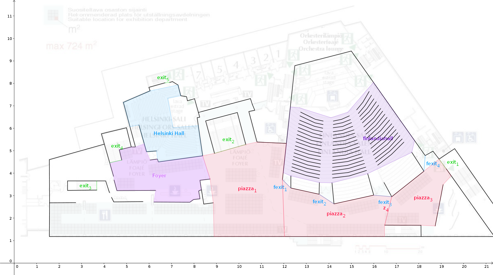

# Algorithm

## Description

Genetic algorithm for optimizing the evacuation time of crowd of people by placing leaders into the area $S$.

## Input

Initial values

- $k$ leaders.
- $m$ different non-empty disjoint regions from the area $S$. We denote individual region by its index $i ∈ \{1, ..., m\}$.
- Population of size of $n$ (simulations per generation).

Total number of combinations of placements of $k$ leaders into $m$ regions.

$$ \binom{m}{k}, m ≥ k $$ 

Each leader is also assigned a target that is one of the exits

$$ Targets = \{exit_i ∣ i ∈ \{1, 5\}\}$$

## Output

Egress time distribution function

- $x$-axis: Unit of time
- $y$-axis: Number of agents that have reached the exit

$$ \frac{\text{number of agents that have reached the exit}}{\text{unit of time}} $$

## Genetic algorithm

- **Individual**: Each suggested solution for a genetic algorithm. *Each individual consists $k$ number of $(region, target)$ tuples. Because leaders are indentical order does not matter.* $$ I = \{(region , target)_1,..., (region , target)_k\}$$
- **Population**: The collection of unique individuals. $$ P = \{I_1, ...,I_n\}, I_i ≠ I_j $$
- **Fitness function**: Measure of how effective each solution (individual) is. *Some function that depends on the cumulative distribution of the egress times of agents. e.g minimize evacuation time of 95% (to avoid pollution from outliers) of the agents.*
- **Grade**: Population's average fitness.

Evolution of population. Advances one **generation** to the next one closer to optimal solution defined by the fitness function. Each cycle consists of

1) **Selection**: Take a portion of best performing individuals. Also randomly select lesser performing individuals for genetic diversity.
2) **Breeding**: Breed together parents to repopulate the population to its desired size.

    *TODO ???*

3) **New population**: Merge together the parents and children to constitute the next generation's population.
4) **Random mutation**: Finally we mutate a small random portion of the population. What this means is to have a probability of randomly modifying each individual. *Change the region where some leader is places of an random individual.*

where the **parameters** are

- Percentage of best performing individual to retain into new generation. $$ p_{retain} \in [0, 1] $$
- Change of random selection of lesser performing individual. $$ p_{selection} \in [0, 1] $$
- Change of mutation. $$ p_{mutation} \in [0, 1] $$

## Implementation Notes

- Simulation exit condition depends on the chosen fitness function
- Memoize the values generated by simulation configurations
